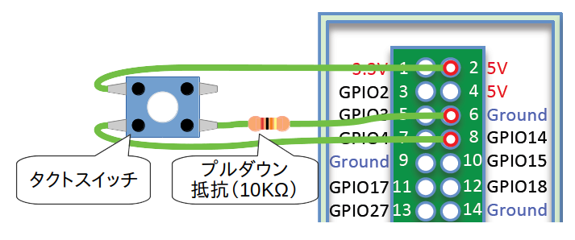

# mpi3 player
Just play mp3


概要
----
ひたすらMP3ファイルをシャッフル再生するサービス。
以下のセットアップは、Raspberry pi想定で書いてます。

セットアップ
------------
### mpg321のインストール

```
$ sudo apt-get install mpg321
```

### アプリの配置とサービス化

```
# 取得
$ git clone https://github.com/yamahei/mpi3_player.git mpi3

# 配置
$ sudo mv mpi3 /opt/
$ sudo chmod +x /opt/mpi3/bin/*

# サービス化
$ sudo cp /opt/mpi3/service/mpi3.service /lib/systemd/system/
$ sudo chown root. /lib/systemd/system/mpi3.service
$ sudo systemctl daemon-reload
$ sudo systemctl enable mpi3 
```

### 起動

```
$ sudo systemctl start mpi3
```

### ログ

```
$ sudo journalctl -f -u mpi3
```

### 空白を含むファイル・ディレクトリ名の処理

```
$ sudo apt-get install rename
$ cd /home/pi/Music
$ find . -name "* *" | rename 's/ /_/g' # エラーでなくなるまで何回か流す
```
* 【参考】[ファイル/ディレクトリ名に空白が入っているファイル/ディレクトリの空白を下線_に置換するワンライナー](https://www.nemotos.net/?p=674)


### スキップコマンドの有効化

```
$ sudo crontab -e
+ @reboot /opt/mpi3/bin/mpi3_gpio.sh
$ sudo reboot
```

タクトスイッチを押したときにスキップコマンドを実行します。



スイッチがGPIO14→GNDで配線されている前提です。
ピンを変える場合は`mpi3_gpio.sh`内にハードコードしてる部分を修正します。

* 【参考】[RaspberryPi の GPIO のプルアップ/ダウン設定について](http://manabi.science/library/2015/09132143/)
* 【参考】[Raspberry PiのGPIOピンの配置図カード](http://herb.h.kobe-u.ac.jp/raspiinfo/gpio_pins_card.html)

